# SkillBrain Python Homework Fork

This repository contains advanced Python homework assignments organized under `assignments/hw_adv`.
The modules progress from Python fundamentals to data science, dashboards, computer vision, and deep learning projects.

## Table of Contents

- [Repository Layout](#repository-layout)
- [Quick Start](#quick-start)
- [Assignment Scope Map](#assignment-scope-map)
- [Assignment Descriptions](#assignment-descriptions)
- [Notes](#notes)

## Repository Layout

- `assignments/hw_adv`: main homework modules (`a_03` to `a_40` ranges)
- `course`: course materials and references
- `sessions`: session exercises and checkpoints
- `hw_templates`: templates and starter structures
- `requirements-all.txt`: broad dependency snapshot used across work

## Quick Start

```bash
python3 -m venv .venv
source .venv/bin/activate
pip install -r requirements-all.txt
```

Some assignments also provide local `requirements.txt` files for isolated environments.

## Assignment Scope Map

| Module | Scope | Primary Files |
|---|---|---|
| `a_03_loops` | loop/control-flow exercises, PIN lockout logic, ASCII/emoji geometry drawing, and plotting helpers | `tema3.py`, `tema_3.ipynb` |
| `a_04_collections` | collections-heavy tasks: playlist/budget/activity assistants plus hobby similarity datasets and analysis | `tema_4_0_anunt.md`, `tema_4_*.ipynb` |
| `a_05_functions` | functional refactors of earlier tasks plus helper package (`painting_on_water`) | `tema_05_*.py`, `painting_on_water/*.py` |
| `a_06_oop` | OOP-oriented modeling and exploration (`mro`, class behavior), with supporting data assets | `senses.py`, `explore/*.py` |
| `a_07_recap` | quiz generation and GUI playthrough backed by JSON question banks | `quiz_maker.py`, `quiz_gui.py`, `quizes.json` |
| `a_08_9_data_struct` | data structures and algorithms: sorting, binary search, and complexity comparisons | `tema_8_9.py`, `tema_8_9.ipynb` |
| `a_10_fleet_game` | package-based fleet routing game with CLI, pygame UI, and pytest suite | `main.py`, `main_pygame.py`, `tests/*` |
| `a_11_hashing` | hashing techniques: duplicate detection, counters, hashmap, autocomplete | `hashing.ipynb` |
| `a_12_caching_lru` | manual cache, LRU patterns, decorators, and cache performance comparisons | `caching_lru.ipynb` |
| `a_13_14_numpy` | beginner and advanced NumPy exercises including broadcasting/vectorization | `13_task_beginner.ipynb`, `14_task_advanced.ipynb` |
| `a_15_numpy` | NumPy bridge toward neural-network concepts | `numpy_advanced_intro_to_neural_nets.ipynb` |
| `a_16_pandas` | DataFrame fundamentals, preparation, transformation, and export pipeline | `16_task_prepare.ipynb` |
| `a_17_pandas` | cleaning pipeline on temporal data, pivoting, missing value strategy, reusable cleaning funcs | `17_task_clean.ipynb` |
| `a_18_matplotlib` | beginner plotting tasks and exported chart/dashboard artifacts | `18_task_beginner.ipynb`, `export/*` |
| `a_19_matplotlib` | advanced matplotlib dashboards, heatmaps, confidence visuals, and style variants | `19_task_advanced.ipynb`, `export/*` |
| `a_20_21_seaborn` | structured seaborn curriculum and implementation notebook | `seaborn_task.MD`, `seaborn_task.ipynb` |
| `a_22_plotly` | interactive/animated Plotly charts and HTML export workflows | `22_plotly.ipynb`, `22_plotly_1.py`, `export/*` |
| `a_23_basic_dashboard` | Streamlit dashboard basics: filters, salary range controls, and KPI cards | `streamlit_app.py`, `app_utils.py` |
| `a_24_advanced_analytics` | interactive analytics dashboard: scatter, correlation matrix, grouped summaries | `streamlit_app.py`, `app_utils.py` |
| `a_25_professional_dashboard` | professionalized Streamlit layout: sidebar controls, payroll views, distribution charts | `streamlit_app.py`, `app_utils.py` |
| `a_26_db_integration` | Streamlit + SQLite pipeline with SQL querying and import/export flow | `streamlit_app.py`, `employees.db` |
| `a_27_leet_code` | curated LeetCode notebook set (Two Sum, Binary Search, DP, arrays/strings basics) | `leet_code.ipynb` |
| `a_28_oos_computer_vision` | experimental CV stack: fire/smoke detection, DeepFace verification, YOLO person/face detection | `fire_detect/*.py`, `match_face/*.py`, `person_detect/*.py` |
| `a_28_opencv` | OpenCV surveillance + smoke detection system with logging, snapshots, and warmup exercises | `opencv_surveillance_project/surveillance_system.py` |
| `a_29_face_recognition` | modular surveillance platform (CLI + PySide6 control center) with YOLO integration and registry | `surveillance_core.py`, `surveillance_app.py`, `control_center_pyside6.py` |
| `a_30_sklearn` | facial-expression pipeline: synthetic image generation, landmarks extraction, model training, realtime inference | `README.md`, `extract_landmarks.py`, `train_model*.py`, `realtime_emotion_detection.py` |
| `a_31_iris_classification` | classical ML iris benchmark (SVM + Random Forest), evaluation, model serialization | `train_iris.py`, `evaluate_and_visualize.py` |
| `a_32_advanced_regression` | real-estate regression benchmark with preprocessing pipelines, model comparison, diagnostics | `train_models.py`, `run_full_analysis.py`, `IMPROVING_TRAINING.md` |
| `a_33_algorithmic` | rule-based medical classifier versus Random Forest comparison on breast cancer data | `breast_cancer_algorithmic_vs_ml.py` |
| `a_34_p1` | word-frequency analysis and stylized wordcloud generation from text corpus | `word_freq.py`, `wordcloud_output.png` |
| `a_35_0_spam_ham` | spam/ham NLP project: NB baselines, static-embedding classifier, automated comparison reporting | `README.md`, `spam_detect.py`, `train_spam_ham_static_v2.py` |
| `a_35_1_mnist` | MNIST dense/CNN training, interactive PySide digit recognizer, activation/focus visualizations | `train_tensorflow.py`, `train_cnn.py`, `digit_recognizer_app.py` |
| `a_36_iris_classification` | TensorFlow iris classifier with config-driven finetuning and reproducible training settings | `iris_classification.py`, `finetune_config.py` |
| `a_37_cnn_fashion` | Fashion-MNIST CNN training, test visualizations, confusion/misclassification analysis | `fashion_cnn_train.py`, `fashion_cnn_test_visuals.py` |
| `a_39_40_yolo_on_feed` | PySide6 + YOLO live feed application (YouTube/stream source), detection overlays, snapshot saves | `youtube_feed_pyside6_yolo.py`, `yolo_feed_config.py` |

## Assignment Descriptions

### `a_03_loops`
Covers loop control, runtime complexity tradeoffs, and geometry rendering both in terminal and plot form.

### `a_04_collections`
Implements practical collection-driven mini systems and includes similarity/embedding datasets used for recommendation-style tasks.

<table>
  <tr>
    <td align="center"></td>
    <td align="center"></td>
  </tr>
</table>

### `a_05_functions`
Refactors multi-step exercises into reusable functions and modules, including utility-style helper code.

### `a_06_oop`
Focuses on OOP design and experimentation around class structure, inheritance behavior, and perception-themed data.

### `a_07_recap`
Builds a quiz authoring + playing workflow with persisted JSON quiz banks and a GUI interface.

### `a_08_9_data_struct`
Combines sorting/search fundamentals with performance comparisons on larger synthetic workloads.

### `a_10_fleet_game`
A full mini-project with package layout, game logic, route simulation, command-line run mode, pygame UI, and tests.

### `a_11_hashing`
Hands-on hashing practice for indexing, duplicate detection, counters, and custom hash structures.

### `a_12_caching_lru`
Explores caching patterns from manual dictionaries to LRU and custom decorators, including timing comparisons.

### `a_13_14_numpy`
Introduces core NumPy operations then escalates into advanced array transformations and broadcasting patterns.

### `a_15_numpy`
Connects NumPy-based tensor intuition to neural-network preparation concepts.

### `a_16_pandas`
Builds and prepares DataFrames from raw arrays and applies transformation/export workflows.

### `a_17_pandas`
Implements a richer cleaning pipeline with temporal slicing, pivot operations, NA strategy, and reusable functions.

### `a_18_matplotlib`
Beginner charting exercises with multiple saved visual outputs and dashboard composition.


### `a_19_matplotlib`
Advanced plotting assignment with confidence intervals, heatmaps, and styled dashboards.

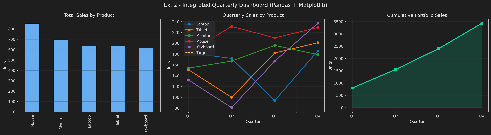
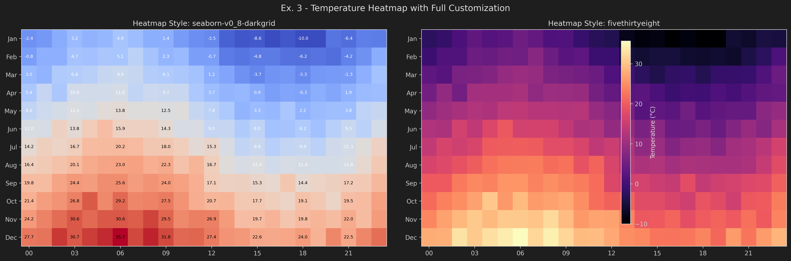
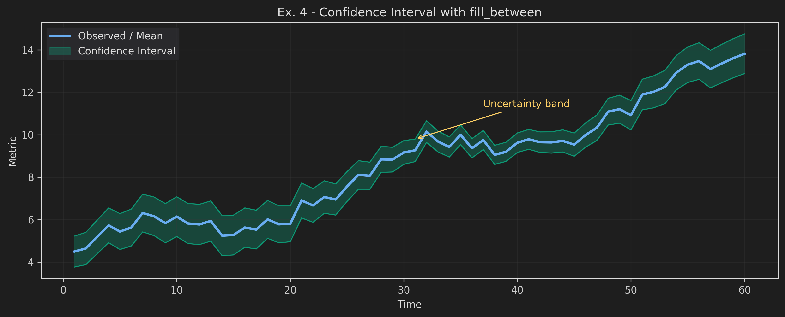
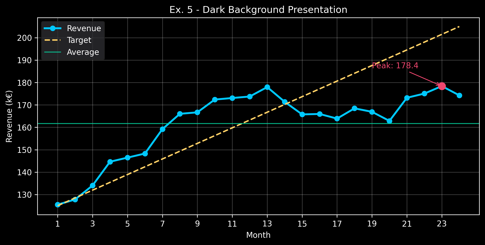

### `a_20_21_seaborn`
A guided seaborn curriculum with progressive exercises and dataset exploration.

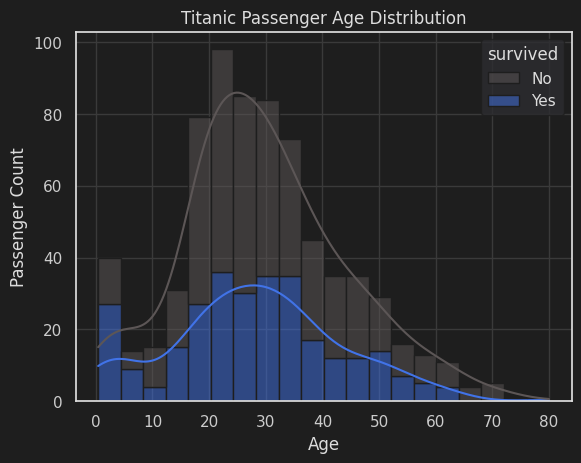
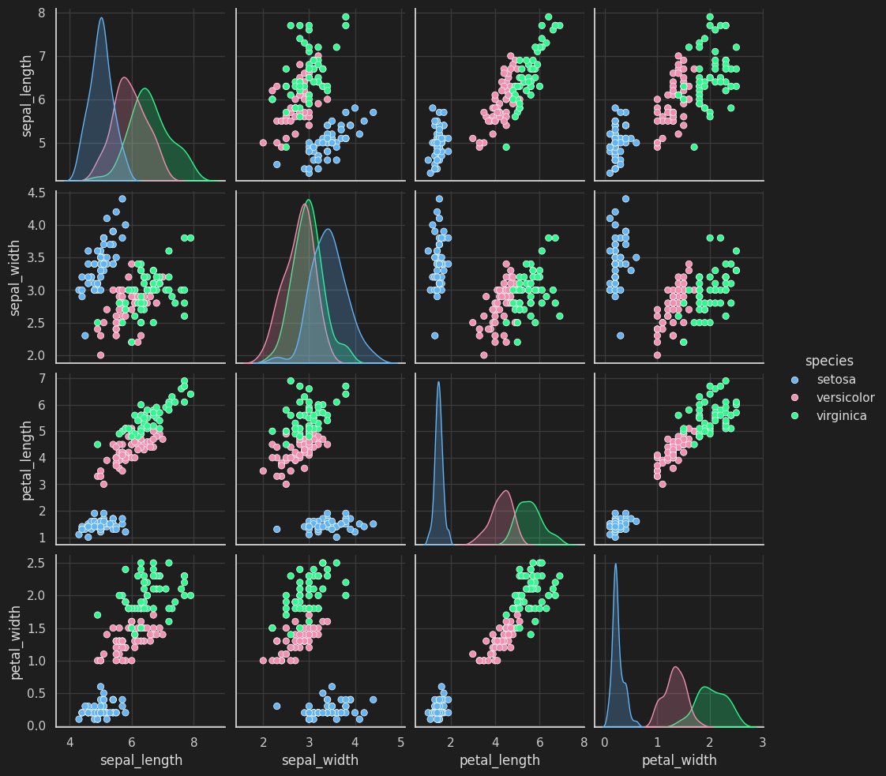
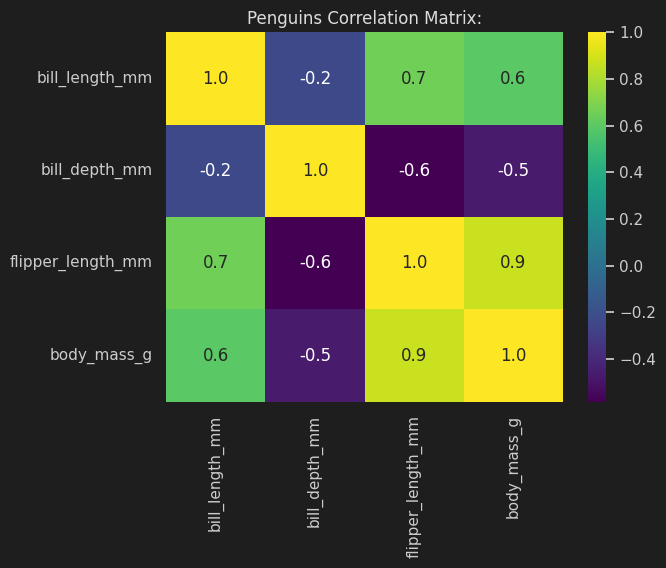
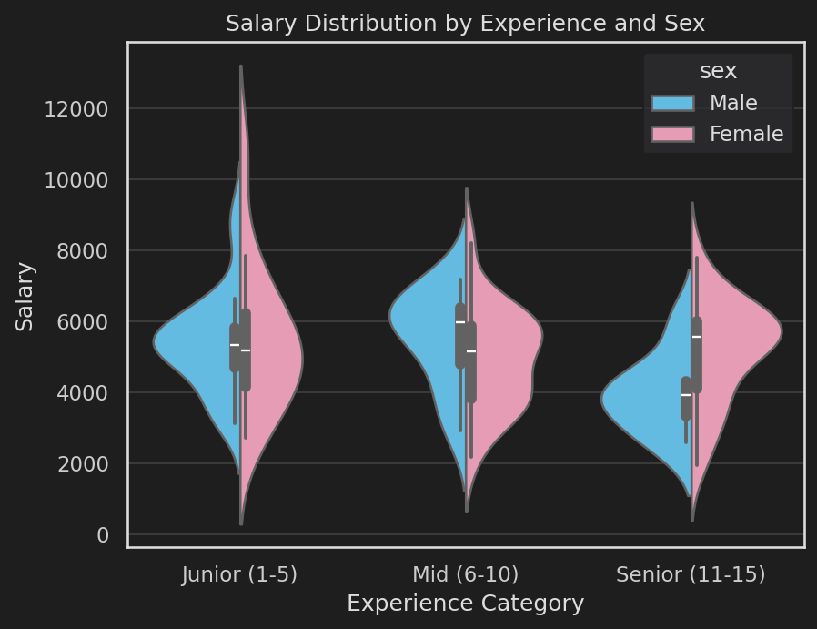
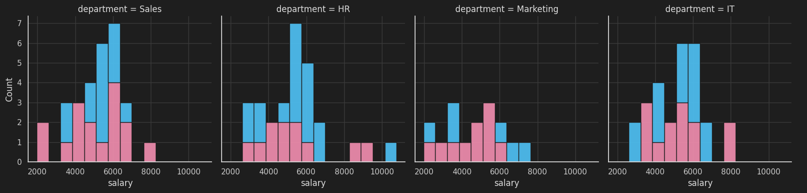
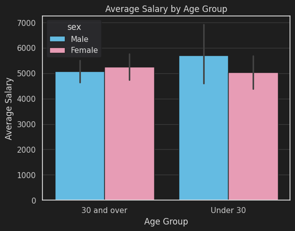

### `a_22_plotly`
Interactive/animated Plotly exercises with shareable HTML outputs and configuration experiments.

Selected lightweight exports:
- [`ex1_scatter_age_experience.html` (~10 KB)](assignments/hw_adv/a_22_plotly/export/ex1_scatter_age_experience.html)
- [`ex2_budget_dashboard.html` (~10 KB)](assignments/hw_adv/a_22_plotly/export/ex2_budget_dashboard.html)
- [`ex3_team_boxplot.html` (~12 KB)](assignments/hw_adv/a_22_plotly/export/ex3_team_boxplot.html)
- [`ex4_random_heatmap.html` (~9 KB)](assignments/hw_adv/a_22_plotly/export/ex4_random_heatmap.html)
- [`challenge2_animated_scatter.html` (~25 KB)](assignments/hw_adv/a_22_plotly/export/challenge2_animated_scatter.html)

Skipped in README due size:
- `ex5_scatter_share_full.html` (~4.7 MB)

### `a_23_basic_dashboard`
Entry-level Streamlit app with table filters and KPI-style summary metrics.

Live app: [basic-dashboard-c.streamlit.app](https://basic-dashboard-c.streamlit.app/)

[](https://basic-dashboard-c.streamlit.app/?embed=true)

[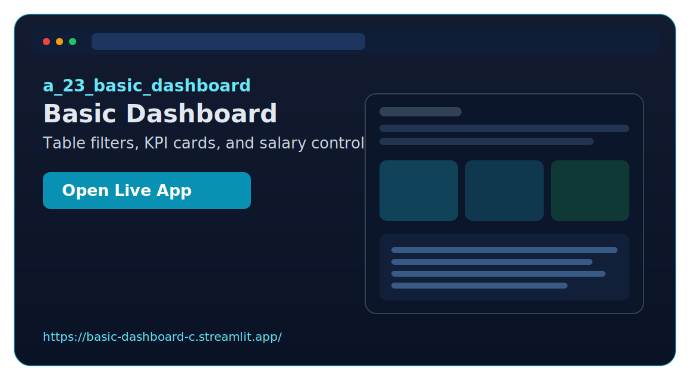](https://basic-dashboard-c.streamlit.app/?embed=true)

### `a_24_advanced_analytics`
Adds interactive analytics controls, correlation exploration, and grouped aggregation views.

Live app: [advanced-analytics.streamlit.app](https://advanced-analytics.streamlit.app/)

[](https://advanced-analytics.streamlit.app/?embed=true)

[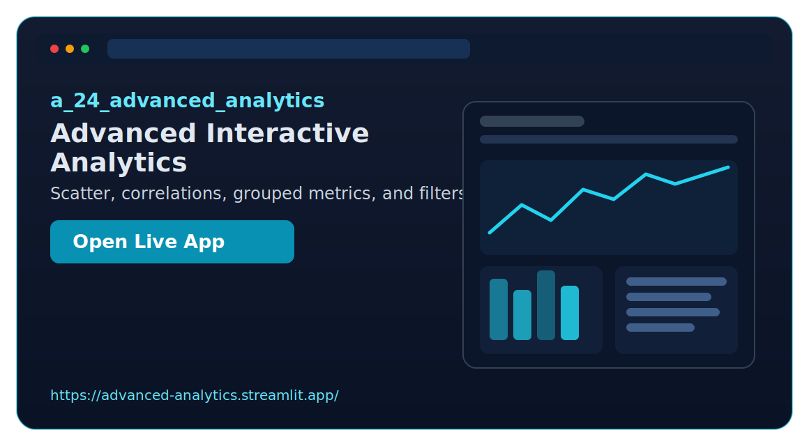](https://advanced-analytics.streamlit.app/?embed=true)

### `a_25_professional_dashboard`
Moves to a professional dashboard style with sidebar controls and management-oriented summaries.

### `a_26_db_integration`
Integrates Streamlit with SQLite for dataset persistence, query execution, and round-trip reads.

### `a_27_leet_code`
Notebook-based algorithm drills spanning arrays, strings, validation problems, and search patterns.

### `a_28_oos_computer_vision`
Experimental CV sandbox combining detection pipelines for smoke/fire, face verification, and person/face camera detection.

### `a_28_opencv`
Operational-style surveillance system with motion/smoke alerts, event logging, and image snapshot evidence.

### `a_29_face_recognition`
A larger surveillance architecture with configurable CLI run mode, GUI control panel, event logging, and recognition workflow.

### `a_30_sklearn`
End-to-end facial-expression ML pipeline from data generation and labeling through features, training, and realtime inference tools.

### `a_31_iris_classification`
Classic sklearn baseline project comparing SVM and Random Forest with saved models.

### `a_32_advanced_regression`
Structured regression benchmark for real-estate prices with preprocessing pipelines and model diagnostics.

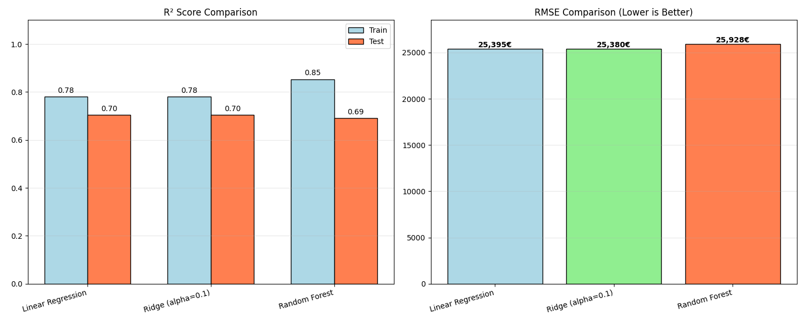

### `a_33_algorithmic`
Contrasts hardcoded domain rules with machine learning on a medical classification dataset.

### `a_34_p1`
Performs text token frequency analysis and renders a stylized word cloud artifact.

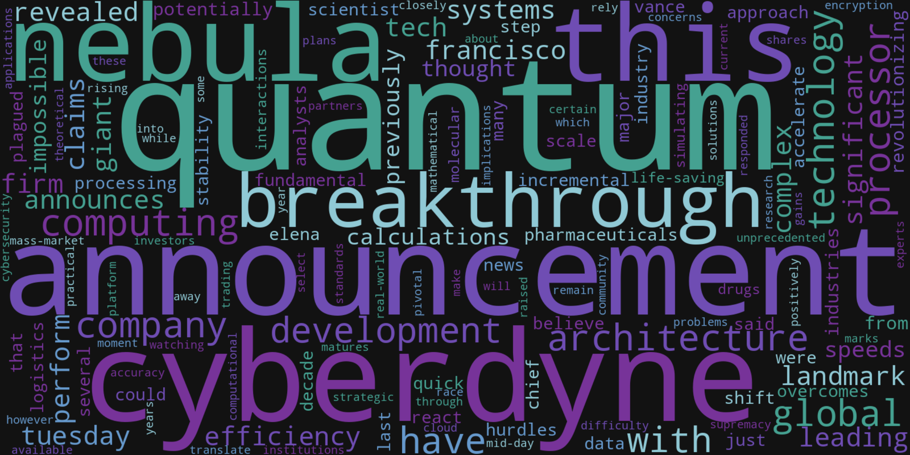

### `a_35_0_spam_ham`
NLP classification project spanning baseline vectorizers, static embeddings, and automated model comparison reports.

### `a_35_1_mnist`
MNIST training plus an interactive digit-drawing recognizer with interpretability visualizations.

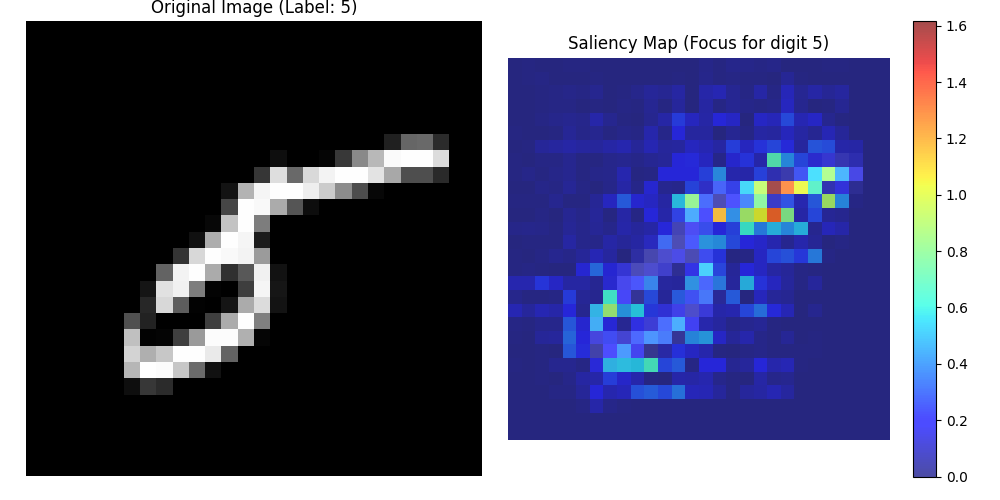

### `a_36_iris_classification`
TensorFlow-based iris pipeline with configurable hyperparameters, early stopping, and reproducibility settings.

### `a_37_cnn_fashion`
Fashion-MNIST CNN workflow including training, evaluation graphics, and error analysis visuals.

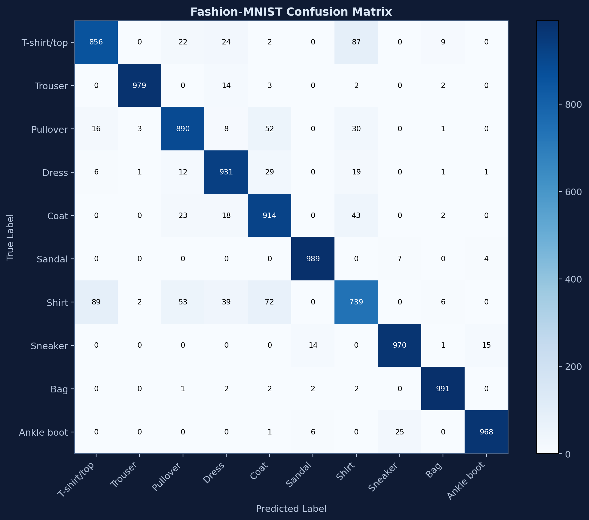

### `a_39_40_yolo_on_feed`
Live-stream YOLO detection app with PySide6 UI controls, model selection, and periodic detection snapshots.

## Notes

- Assignment folders are intentionally heterogeneous: some are notebook-first, others are full Python projects with tests and app UIs.
- For CV/ML-heavy modules (`a_28+` and `a_30+`), prefer per-folder `requirements.txt` and local READMEs where present.
